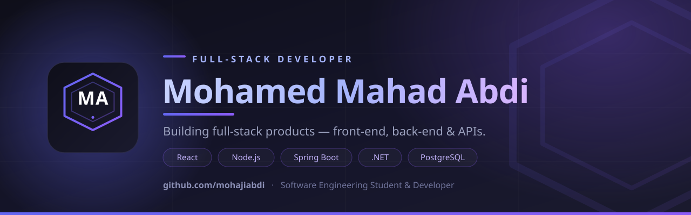

# Hi, I'm Mohamed Mahad Abdi 👋 &nbsp;·&nbsp; aka MoHaji Abdi

**Software Engineering student & full-stack developer.** I build complete web applications — front-end and back-end — and I'm always learning cutting-edge technologies. I enjoy turning real-world problems into clean, working code.

---

## 🚀 Tech Stack

**Frontend**

**Backend**

**Databases**

**Tools & Workflow**

---

## 🌟 Featured Project — AI History

A private, encrypted desktop application that indexes and searches AI coding conversations locally across Claude Code, OpenCode, Gemini CLI, Codex, and Cursor. Built with TypeScript, React, Electron, and SQLCipher.

AI History is a local-first application designed with privacy in mind. Your conversations remain on your own machine with no cloud storage, no telemetry, and no accounts required.
---

## 📊 GitHub Stats

  
  

---

## 📫 Connect

- 💻 GitHub: [@mohajiabdi](https://github.com/mohajiabdi)
- 🚀 Currently building full-stack apps and learning new technologies every day

> _Always open to collaboration and new challenges._
