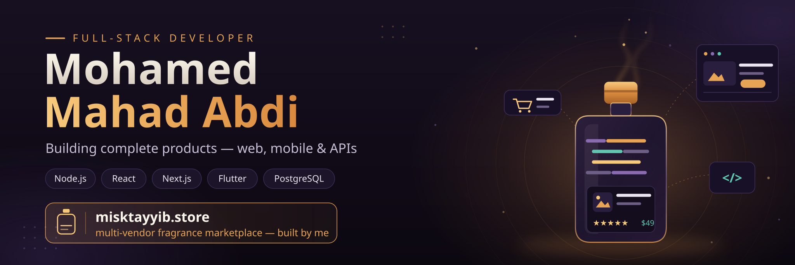

# Software Developer/ Front-End/ Back-End/ UI UX and More...
## Hi, I’m Mohamed Mahad Abdi Aka MoHaji Abdi

I’m a Software Engineering Student & Developer passionate about building full-stack applications and learning cutting-edge technologies. I love working with both front-end and back-end, and I enjoy solving real-world problems with code.

# 🚀 Tech Stack

## Frontend:

###    1. HTML • CSS • JavaScript (ES6+)
  
###    2. React.js • Tailwind CSS • Bootstrap

## Backend:

  ###    1. Java (Spring Boot)
  
  ###    2. C# (.NET)
  
  ###    3. NodeJs

## Databases:

###    1. PostgreSQL • SQL Server
###    2. Mongo Db

## Other:

###   1.  Git • GitHub • REST APIs
###   2.  Git • GitLab •
